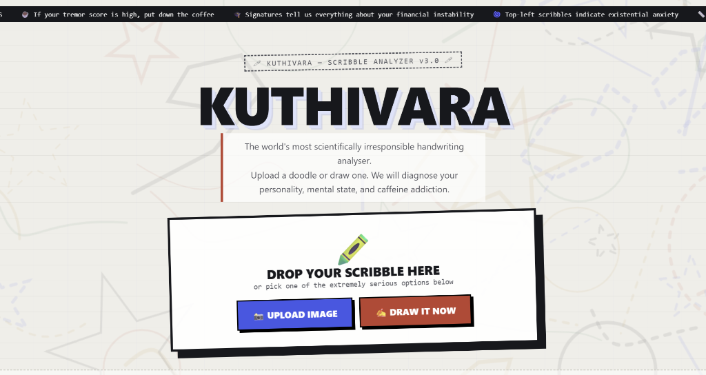
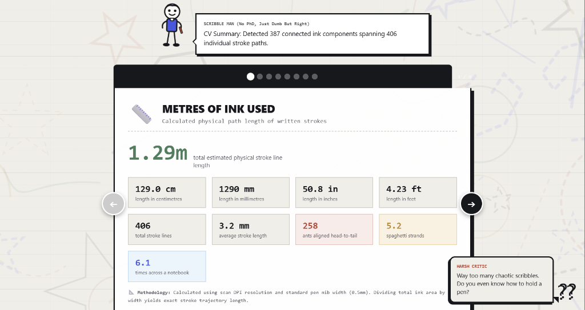
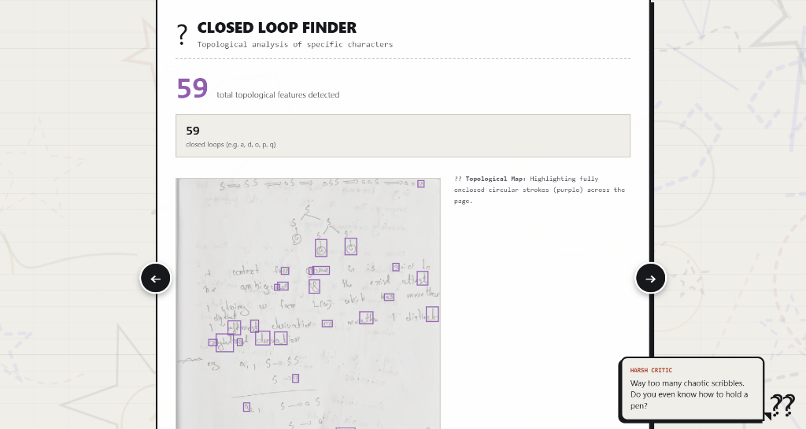

# KUTHIVARA — The Useless Scribble Analyser 🎯

## Basic Details
### Team Name: Erasers

### Team Members
- Team Lead: Naveen B S - Sree Chithira Thirunal College of Engineering
- Member 2: Vidyuth S A - Sree Chithira Thirunal College of Engineering

### Project Description
A Computer Vision web application that dissects any handwritten page into absurdly detailed forensic metrics. It is a fully client-side, zero-dependency HTML/JS app that runs entirely in your browser to count pixels, measure exact ink length, and identify pigment colors.

### The Problem (that doesn't exist)
When you scribble mindlessly on the back of your notebook during a boring lecture, how do you know *exactly* how many meters of ink you wasted? What is the exact CIELAB chromaticity of your cheap ballpoint pen? How many closed topological loops are in your messy handwriting? Society has ignored this critical data for far too long.

### The Solution (that nobody asked for)
We built an over-engineered, mathematically rigorous Computer Vision engine that runs entirely in your browser. It uses Principal Component Analysis (PCA), integral image box filtering, and stack-based flood filling just to tell you that your handwriting looks like a medical prescription and you used roughly 5 spaghetti-strands worth of ink. It also features "Scribble Man" (who has no PhD) and a harsh virtual critic to judge your spatial awareness.

## Technical Details
### Technologies/Components Used
For Software:
- HTML5, CSS3, Vanilla JavaScript (ES6+)
- None (100% Client-Side)
- None (Zero dependencies, no npm)
- HTML5 Canvas 2D API, Hand-rolled Math algorithms (PCA, CIELAB transforms)

### Implementation
For Software:
# Installation
```bash
git clone https://github.com/naveenbs8921/useless_project_temp.git
cd useless_project_temp
```

# Run
```bash
npx serve .
# Or simply open index.html in any modern web browser.
```

### Project Documentation
For Software:

# Screenshots (Add at least 3)

*The KUTHIVARA landing page featuring our brutalist UI design and the interactive dropzone to upload messy handwriting.*


*The 'Metres of Ink' panel calculating the exact physical stroke length and converting it into highly scientific units like 'spaghetti strands', narrated by Scribble Man.*


*Our custom Closed Loop Finder successfully running topological hole detection to isolate and highlight enclosed loops, while the Harsh Critic roasts the user.*

# Diagrams

*Our zero-dependency Computer Vision pipeline: Thresholding -> Flood Fill -> PCA Elongation -> Topological Hole Detection -> Scale-Invariant Classification.*

For Hardware:

# Schematic & Circuit

*N/A*


*N/A*

# Build Photos

*N/A*


*N/A*


*N/A*

### Project Demo
# Video
[Add your demo video link here]
*A walkthrough of uploading a handwritten page and navigating through the 8 absurdly detailed computer vision report panels.*

# Additional Demos
[Add any extra demo materials/links]

## Team Contributions
- Naveen B S: Core Computer Vision algorithms, Topological loop detection, Data structuring, and Project Architecture.
- Vidyuth S A: UI/UX design, Brutalist CSS styling, Interactive Report Panels, and Humor/Mascot logic integrations.

---
Made with ❤️ at TinkerHub Useless Projects
