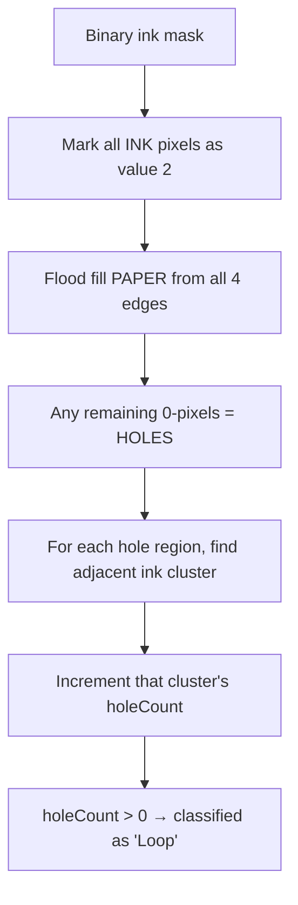

<div align="center">
  <h1>KUTHIVARA — The Useless Scribble Analyser 🎯</h1>
  <p><i>The world's most over-engineered doodle analyser.</i></p>
  <p>
    
    
    
  </p>
</div>

---

## 🏆 Hackathon Details
* **Event:** TinkerHub Useless Projects Hackathon
* **Team Name:** Erasers
* **Team Members:** 
  * **Naveen B S** (Sree Chitra Thirunal College of Engineering) - *Core CV Algorithms, Topology, Architecture*
  * **Vidyuth S A** (Sree Chitra Thirunal College of Engineering) - *UI/UX, Brutalist Styling, Mascot Integration*

---

## 🤷‍♂️ The Problem (that doesn't exist)
When you scribble mindlessly on the back of your notebook during a boring lecture, how do you know *exactly* how many meters of ink you wasted? What is the exact CIELAB chromaticity of your cheap ballpoint pen? How many closed topological loops are in your messy handwriting? Society has ignored this critical data for far too long. 

## 💡 The Solution (that nobody asked for)
We built an over-engineered, mathematically rigorous Computer Vision engine that runs entirely in your browser. It uses Principal Component Analysis (PCA), integral image box filtering, and stack-based flood filling just to tell you that your handwriting looks like a medical prescription and you used roughly 3 spaghetti-strands worth of ink. 

---

## ⚙️ How It Works (The 100% Client-Side Pipeline)

The entire application is a **single HTML file** (~1400 lines). No build tools, no frameworks, no backend. 

### 1. Zero-Dependency Computer Vision
* **Thresholding:** Converts images to grayscale and applies Otsu-style binary thresholding via the Canvas 2D API.
* **Component Labeling:** Stack-based flood fill groups touching ink pixels into distinct clusters.
* **PCA Elongation:** Generates covariance matrices to find eigenvalues (λ₁/λ₂) and calculate stroke direction/wobble.
* **Color Spectrometry:** Converts sRGB values into HSV and CIELAB perceptual color spaces to classify exact pigment types.

### 2. Topological Loop Detection
Our most sophisticated algorithm:


---

## 📊 The 8 Report Panels

| # | Panel | What It Shows |
|---|-------|---------------|
| 1 | **📏 METRES OF INK** | Calculates actual physical length of ink strokes (in metres) + fun comparisons (ants, spaghetti) |
| 2 | **📊 OVERVIEW** | Total ink coverage %, pixel count, cluster count, signatures, letters, loops, dominant color |
| 3 | **🎨 PIGMENT SPECTROSCOPE** | Identifies ink color (HEX, RGB, HSV, CIELAB). Includes a real-time pixel inspector |
| 4 | **⭕ CLOSED LOOP FINDER** | Uses topology to count enclosed loops (`a, d, o, p, q`). Highlights every loop in purple |
| 5 | **📦 CLUSTER BREAKDOWN** | Categorizes every blob as Signature / Letter / Loop / Line / Scribble with bounding boxes |
| 6 | **🔥 DENSITY MAP** | Heatmap of local ink concentration using integral image box filtering |
| 7 | **📐 LINE WOBBLE** | PCA-based analysis measuring RMS perpendicular deviation from the fitted straight axis |
| 8 | **🔍 CV DIAGNOSIS** | An interactive MCQ quiz testing if the computer's classification matches reality |

---

## 🚀 How to Run

Because it has **zero dependencies**, running it is absurdly easy:

1. Clone the repository:
   ```bash
   git clone https://github.com/naveenbs8921/A_Random_Page_Analyzer.git
   ```
2. Open `ink_report.html` in **any modern web browser**. 
3. That's it. No `npm install`, no python servers, no backend.

---
*Made with ❤️ at TinkerHub Useless Projects*
